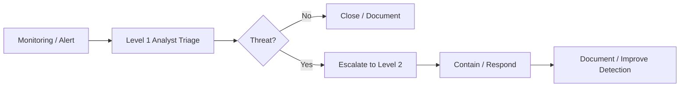

# Secure Enterprise Network Design

## Overview

This repository presents a **group university network-design case study** completed as part of my BSc Ethical Hacking and Cybersecurity degree.

The original scenario required the team to design a secure enterprise network for a multi-floor organisation, including segmentation, internet-facing services, resilience, monitoring, remote-site connectivity and future growth.

> **Group-work note:** this repository is based on the submitted group design. I am not presenting the full design as solely my individual work. The purpose of this portfolio version is to show the security and analyst-relevant decisions contained in the project.

## Scenario

The proposed environment included:

- multiple business departments across several floors
- a separate floor rented to another company
- internal servers and internet-facing services
- a second site several miles away
- wired and wireless users
- future expansion requirements
- business-critical services requiring high availability

The core security problem was therefore: **how do you keep different users, departments, services and external-facing systems connected without giving them unnecessary access to one another?**

## Security Design Decisions

### 1. Hierarchical Network Design

The group proposed a three-tier architecture:

- **Core layer** — high-speed backbone and resilient interconnection
- **Distribution layer** — routing, policy enforcement and traffic filtering
- **Access layer** — end-user devices, switches and wireless access

This structure made the network easier to segment, scale and troubleshoot than a flat design.

### 2. VLAN and Subnet Segmentation

Departments were separated into their own logical network segments rather than placing all users into one flat broadcast domain.

The design used VLANs and separate subnets to reduce unnecessary communication between departments and make access-control rules easier to enforce.

### 3. ACL-Based Access Control

The distribution layer was identified as the main policy-enforcement point.

Access Control Lists (ACLs) were proposed to filter traffic by:

- source / destination address
- protocol
- port

This is directly relevant to analyst work because network segmentation determines what lateral movement is possible after a host is compromised.

### 4. DMZ for Internet-Facing Services

The design placed public-facing web and email services in a **DMZ**, separating them from the internal corporate network.

This limits the blast radius if an internet-facing service is compromised.

### 5. Isolation of Third-Party / Rented-Floor Traffic

The rented floor was placed on a separate subnet and restricted using ACLs.

A separate internet connection was also proposed so that third-party traffic interacted with the main company infrastructure as little as possible.

This is a strong example of reducing trust between organisational boundaries.

### 6. Site-to-Site VPN

For communication between the new building and the existing site, the group proposed a VPN tunnel between border routers rather than exposing inter-site traffic directly across the public internet.

### 7. Resilience and Availability

The design included:

- redundant links
- partial-mesh connectivity
- backup power supplies
- UPS protection
- hot-swappable components
- redundant network devices
- STP to prevent Layer 2 loops while retaining backup paths

These controls were intended to reduce single points of failure and maintain service availability.

## Analyst View: Why the Architecture Matters

A SOC analyst does not need to design every enterprise network, but understanding the architecture makes investigations much stronger.

| Design Feature | Analyst Relevance |
|---|---|
| VLAN segmentation | Helps identify whether traffic is normal inter-segment communication or suspicious lateral movement |
| ACLs | Explains which connections should or should not be possible |
| DMZ | Helps separate internet-facing compromise from internal compromise |
| Guest / third-party isolation | Provides context for trust boundaries and unusual cross-network traffic |
| VPN tunnel | Helps identify expected encrypted site-to-site traffic |
| Redundancy / STP | Helps distinguish security incidents from infrastructure failures |
| Network baselining | Supports anomaly detection and performance/security monitoring |

## Threats Considered

The original design discussed several relevant threats:

- unauthorised access
- weak credentials
- insider misuse
- social engineering
- DDoS
- malware
- physical access to servers

The proposed controls included layered access restrictions, staff awareness, mail filtering, gateway inspection, endpoint protection, physical access controls and monitoring.

See [security-controls-and-threats.md](docs/security-controls-and-threats.md).

## Monitoring and SOC Workflow

The project also included a simple SOC escalation model:



This is simplified compared with a real SOC, but it shows awareness of triage, escalation, response and feedback into future detection.

## Skills Demonstrated

- enterprise network architecture
- VLAN and subnet segmentation
- ACL-based access control
- DMZ design
- site-to-site VPN concepts
- network resilience and redundancy
- threat modelling
- network monitoring concepts
- SOC escalation concepts
- risk-based security design
- technical documentation and group collaboration

## Retrospective

With my current security-operations perspective, I would improve the design by:

- applying least-privilege rules more explicitly between VLANs
- documenting allowed flows in a formal network-access matrix
- separating management, server, user, guest and security-tooling networks more clearly
- adding centralised logging from firewalls, switches, VPN gateways and authentication systems
- defining exact detection use cases for cross-segment traffic
- using modern identity and network-access controls rather than relying heavily on static perimeter controls
- documenting recovery objectives and failover testing
- validating all product and protocol choices against current standards

The strongest lesson from the project is that **good detection depends on understanding what the network is designed to allow**.

## Repository Structure

```text
.
├── README.md
└── docs/
    ├── segmentation-and-trust-boundaries.md
    ├── security-controls-and-threats.md
    └── analyst-investigation-context.md
```