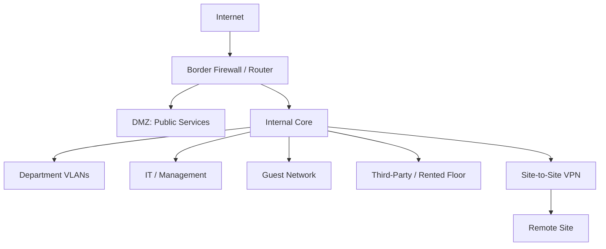

# Segmentation and Trust Boundaries

## Purpose

The original design used segmentation to prevent a large enterprise network from behaving like one flat trusted environment.

## Key Segments

### Department Networks

Departments were placed into separate VLANs / subnets. This reduced broadcast scope and created clear points where access controls could be applied.

### Internet-Facing Services

Public web and email services were placed in a DMZ rather than directly inside the internal network.

### Third-Party / Rented Floor

The rented floor was designed as a separate network with ACL restrictions and reduced interaction with the main organisation.

### Guest Wireless

Guest wireless was assigned its own addressing space rather than sharing internal user networks.

### Remote Site

The old and new sites were to communicate through a site-to-site VPN tunnel over existing internet infrastructure.

## Trust-Boundary View

> This is a portfolio reconstruction of the logical trust boundaries described in the original group report, not the original topology diagram.

## Analyst Relevance

During an investigation, segmentation helps answer:

- Should this source system be able to reach this destination?
- Is this traffic crossing a trust boundary?
- Is a compromised endpoint attempting lateral movement?
- Is third-party traffic entering a corporate segment?
- Is an internet-facing host communicating unexpectedly with sensitive internal systems?

Without this architectural context, suspicious traffic is harder to distinguish from legitimate activity.